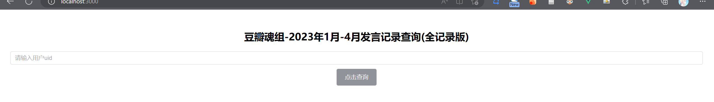

# ASoul-Douban-2023_April
本仓库是提供豆瓣魂组2023年1月至4月组内发帖统计的网站的源码。您可以Clone源码自行部署。

本文档提供了如何部署的详细说明。

## 准备 Preliminaries

如果您要部署，您运行的环境需要满足以下条件：

- Nodejs Version>=16.15
- sqlite interface support (在大多数设备上都是支持的，通常不需要担忧这一点)

而后，您应该Clone源码至本地，而后在它的根目录下，运行下述命令安装必要的依赖：

```
npm install
```

由于代码和数据并不放在一个仓库里，您需要前往 [豆瓣魂组数据镜像-数据存储仓](https://github.com/ASOUL-DoubanGroup-Mirror/Data/releases/tag/2023-01_04)，下载该页面的 `ASOUL-Douban-2023.1_2023.4.zip`，将数据解压至根目录下。

在依赖以及数据都已经完成后，在根目录运行：

```
node server.js
```

便可完成部署。

默认情况下，访问`http://localhost:3000`，便能看到部署完成的网页：



## 注意事项 Notice

请注意，默认端口为3000。如果需要更改端口，请在`server.js`中更改端口：

```javascript
const port = 3000
```

同样，由于网页应用是前后端解耦的，您要前往`frontend/config.js`，进行资源访问的修改；或者，若您想要外部能够访问该网页，您也要修改下面代码的地址为您的部署地址：

```javascript
window._TEST_SERVER = "http://your_host and port"
```

即：若我想在一个公网ip`127.12.3.1`的服务器上，于端口`3001`部署本应用，我应该首先修改`server.js`:

```javascript
const port = 3001
```

而后修改`config.js`:

```javascript
window._TEST_SERVER = "http://127.12.3.1:3001"
```


